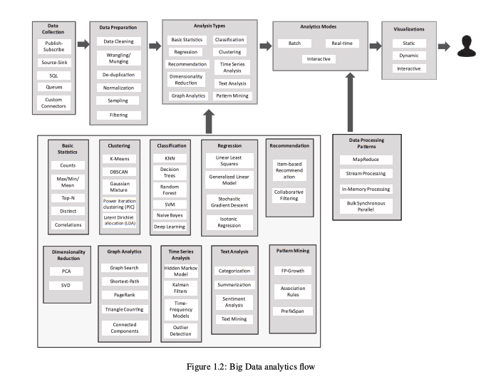
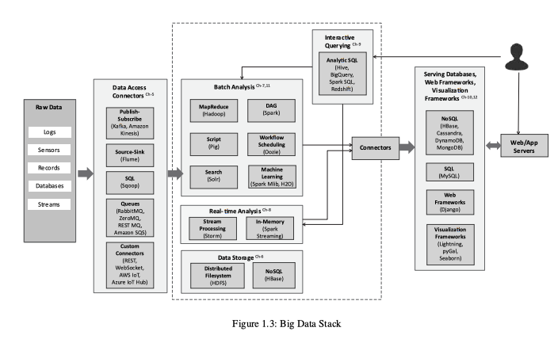
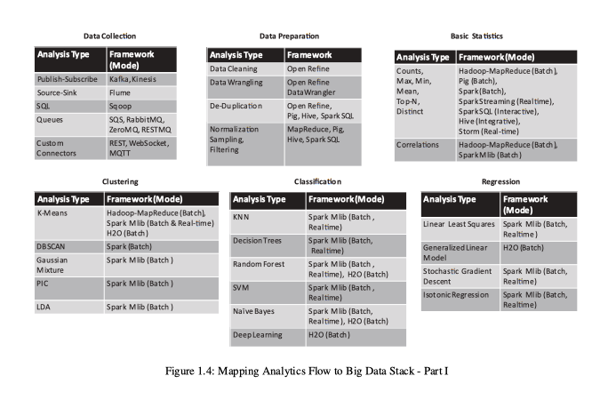
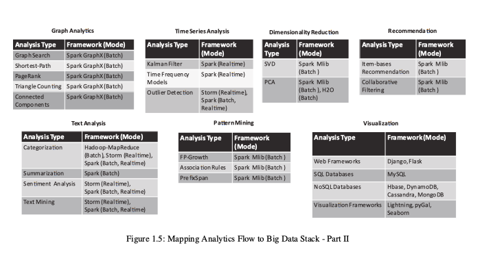
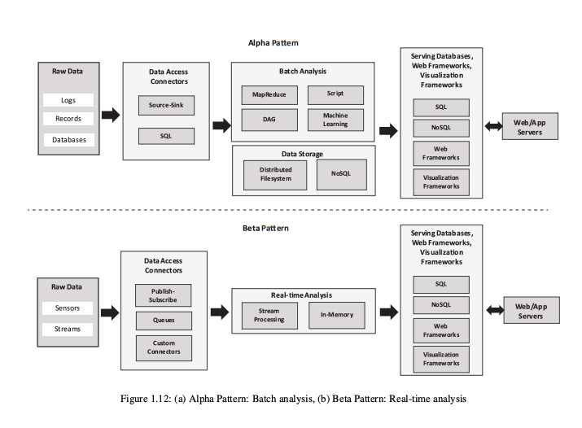
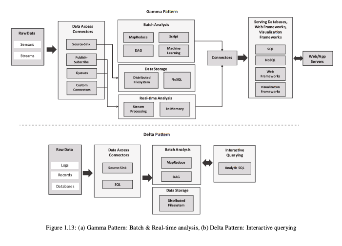

# Introduction to Big Data & Analytics — Complete Notes

---

## Table of Contents

1. [Introduction to Analytics](#1-introduction-to-analytics)
2. [What is Big Data?](#2-what-is-big-data)
3. [Characteristics of Big Data (5 V's)](#3-characteristics-of-big-data-5-vs)
4. [Domain-Specific Examples of Big Data](#4-domain-specific-examples-of-big-data)
5. [Analytics Flow for Big Data](#5-analytics-flow-for-big-data)
6. [Big Data Stack](#6-big-data-stack)
7. [Mapping Analytics Flow to Big Data Stack](#7-mapping-analytics-flow-to-big-data-stack)
8. [Analytics Patterns](#8-analytics-patterns)

---

## 1. Introduction to Analytics

- **Analytics** — Process of extracting insights from raw data
- **Purpose:** Convert data → information → knowledge

---

### Types of Analytics

| Type | Question Answered | Method |
|------|-------------------|--------|
| **Descriptive** | What happened? | Uses statistics and historical data |
| **Diagnostic** | Why did it happen? | Finds root cause |
| **Predictive** | What will happen? | Uses ML (Machine Learning) models |
| **Prescriptive** | What should be done? | Suggests actions based on predictions |

#### Analytics Progression Flow

```
Descriptive → Diagnostic → Predictive → Prescriptive
```

---

### Key Points

- Raw data has no meaning on its own
- Analytics makes systems intelligent
- Used across all domains

---

## 2. What is Big Data?

- **Big Data** — Large and complex datasets that cannot be processed using traditional systems

---

### Characteristics

- Large size
- High speed of generation
- Multiple formats (structured, unstructured, semi-structured)

---

### Sources of Big Data

- Social media
- Sensors (IoT — Internet of Things)
- Financial systems
- Healthcare systems
- Application logs

---

### Big Data Analytics Lifecycle

```
Collection → Storage → Processing → Analysis
```

---

### Technologies Used

- Distributed systems (Hadoop, Spark)
- Cloud computing
- NoSQL (Non-relational) databases

---

### Key Points

- Traditional DBs (Databases) **cannot handle** big data
- Requires **parallel processing**
- Used for **intelligent decision making**

---

### Examples of Big Data

- Clickstream data (user browsing behaviour)
- Sensor data
- Social media posts and interactions

---

## 3. Characteristics of Big Data (5 V's)

| V | Name | Description | Example |
|---|------|-------------|---------|
| **V1** | **Volume** | Enormous amount of data | TB (Terabytes), PB (Petabytes), EB (Exabytes) scale |
| **V2** | **Velocity** | Speed at which data is generated | Real-time data streams from IoT devices |
| **V3** | **Variety** | Different data formats | Structured, semi-structured, unstructured |
| **V4** | **Veracity** | Quality and trustworthiness of data | Noise, inconsistency, missing values |
| **V5** | **Value** | Usefulness of the data | Insights extracted from raw data |

---

### Key Points

- All 5 V's together define Big Data
- **Value** is the most important V — the goal of all processing
- **Veracity** directly affects the accuracy of analysis

---

## 4. Domain-Specific Examples of Big Data

| Domain | Data Type | Use Case |
|--------|-----------|---------|
| **Web** | Social media, search engines | Recommendations, targeted ads |
| **Financial** | Transactions, stock data | Fraud detection, risk analysis |
| **Healthcare** | Patient records, lab results | Disease prediction, diagnostics |
| **IoT (Internet of Things)** | Sensors, smart devices | Monitoring and automation |
| **Environment** | Weather, climate data | Disaster prediction, climate modelling |
| **Logistics** | GPS (Global Positioning System), traffic data | Route optimization, delivery tracking |
| **Industry** | Machine sensor data | Predictive maintenance |
| **Retail** | Customer purchase data | Product recommendations |

---

### Key Points

- Big Data is used in **all domains**
- Improves decision making
- Enables automation of processes

---

## 5. Analytics Flow for Big Data

- **Analytics Flow** — The process of converting raw data into actionable insights



*Figure 1.2: Big Data analytics flow — Data flows from Collection → Data Preparation → Analysis Types (Basic Statistics, Clustering, Classification, Regression, Recommendation, Dimensionality Reduction, Graph Analytics, Time Series Analysis, Text Analysis, Pattern Mining) → Analytics Modes (Batch, Real-time, Interactive) → Visualizations (Static, Dynamic, Interactive). Data Processing Patterns include MapReduce, Stream Processing, In-Memory Processing, and Bulk Synchronous Parallel.*

---

### Steps in Analytics Flow

| Step | Description | Key Activities |
|------|-------------|----------------|
| **1. Data Collection** | Gather data from all sources | Publish-Subscribe, Source-Sink, SQL, Queues, Custom Connectors |
| **2. Data Preparation** | Clean and organize data for analysis | Data Cleaning, Wrangling/Munging, De-duplication, Normalization, Sampling, Filtering |
| **3. Analysis Types** | Apply appropriate analytical technique | Descriptive, Predictive, Clustering, Classification, etc. |
| **4. Analysis Modes** | Choose how analysis is run | Batch, Real-time, or Interactive |
| **5. Visualization** | Present results to end users | Static, Dynamic, or Interactive charts and dashboards |

---

### Key Points

- **Data preparation is critical** — poor data leads to poor results
- **Visualization** improves understanding and communication
- Supports decision making at all levels
- **Flow must be followed sequentially**

---

## 6. Big Data Stack

- **Big Data Stack** — Complete multi-layer system for big data processing
- Each layer handles a different part of the data lifecycle



*Figure 1.3: Big Data Stack — Raw Data (Logs, Sensors, Records, Databases, Streams) → Data Access Connectors (Kafka, Flume, Sqoop, Queues, Custom Connectors) → Batch Analysis (MapReduce/Hadoop, Pig, Solr) + Real-time Analysis (Storm Streaming) + In-Memory (Spark Streaming) + NoSQL Storage (HBase) + Distributed Filesystem (HDFS) → Interactive Querying (Hive, BigQuery, Spark SQL, Redshift) → Connectors → Serving Databases / Web Frameworks / Visualization Frameworks (NoSQL, SQL, Django, pyGal, Seaborn) → Web/App Servers*

---

### Layers of the Big Data Stack

| Layer | Tools / Technologies | Description |
|-------|---------------------|-------------|
| **Raw Data** | Logs, sensors, social media, databases, streams | Original source data |
| **Data Access Connectors** | Kafka, Flume, Sqoop | Ingestion and transfer of data |
| **Distributed Storage** | HDFS (Hadoop Distributed File System), NoSQL (HBase) | Store large datasets |
| **Batch Processing** | MapReduce, Pig, Spark, DAG (Directed Acyclic Graph) | Process large historical datasets |
| **Real-time Processing** | Storm, Spark Streaming | Process live incoming data |
| **Machine Learning** | Spark MLlib, H2O | Training and inference on large datasets |
| **Interactive Query** | Hive, Spark SQL, Redshift | Query data on demand |
| **Serving DB (Database)** | MySQL, MongoDB, Cassandra, DynamoDB | Store results for serving to applications |
| **Visualization** | Django, pyGal, Seaborn, Lightning | Display results as charts and dashboards |
| **Web/App Servers** | Web applications | Deliver results to end users |

---

### Key Points

- **Multi-layer architecture** covering the full data lifecycle
- Supports the complete journey from raw data to insights
- Uses multiple tools working together
- Maps directly to the **Analytics Flow** (Topic 5)

---

## 7. Mapping Analytics Flow to Big Data Stack

- Connecting each analytics step to the specific tools that implement it

---

### Part I — Data Collection, Preparation, Basic Statistics, Clustering, Classification, Regression



*Figure 1.4 (Part I): Maps data collection methods (Kafka, Flume, Sqoop, ZeroMQ, REST, MQTT), data preparation frameworks (Open Refine, DataWrangler, MapReduce, Pig, Hive, Spark SQL), and analysis types — Basic Statistics (Hadoop-MapReduce, Spark, Storm), Clustering (Hadoop-MapReduce, Spark MLlib, H2O), Classification (Spark MLlib), and Regression (Spark MLlib, H2O) — to their corresponding frameworks and processing modes.*

---

### Part II — Graph Analytics, Time Series, Text Analysis, Pattern Mining, Recommendation, Dimensionality Reduction, Visualization



*Figure 1.5 (Part II): Maps Graph Analytics (Spark GraphX Batch), Time Series Analysis (Spark Realtime, Storm Realtime), Text Analysis (Hadoop-MapReduce, Storm, Spark), Pattern Mining (Spark MLlib), Recommendation (Spark MLlib Batch), Dimensionality Reduction (Spark MLlib, H2O), and Visualization (Django/Flask, MySQL, HBase/DynamoDB/MongoDB, Lightning/pyGal/Seaborn) to frameworks and modes.*

---

### Summary Mapping Table

| Analytics Step | Tools Used |
|----------------|-----------|
| **Data Collection** | Kafka, Flume, Sqoop, ZeroMQ, RabbitMQ, REST, WebSocket, MQTT |
| **Data Preparation** | Pig, Hive, Spark SQL, Open Refine, DataWrangler, MapReduce |
| **Analysis (Batch)** | MapReduce, Spark, Spark MLlib |
| **Analysis (Real-time)** | Apache Storm, Spark Streaming |
| **Interactive Querying** | Hive, Spark SQL |
| **Visualization** | Django, Seaborn, pyGal, Lightning |

---

### Key Points

- Tool selection depends on: **data type**, **velocity**, and **use case**
- Different analysis types require different tools
- Proper mapping ensures **efficient system design**

---

## 8. Analytics Patterns

- **Analytics Patterns** — Standard reference architectures for building big data systems
- Combine tools and frameworks into proven designs

---

### Alpha Pattern — Batch Processing

- Processes large volumes of **historical/stored data** in batches

| Component | Tools |
|-----------|-------|
| **Data Ingestion** | Flume, Sqoop, Source-Sink, SQL |
| **Storage** | HDFS (Hadoop Distributed File System), HBase, NoSQL |
| **Processing** | MapReduce, DAG (Directed Acyclic Graph with Spark), Pig, Spark |
| **Serving** | MySQL, MongoDB |

**Use Cases:** Web analytics, healthcare analysis, enterprise reporting

---

### Beta Pattern — Real-time Processing

- Processes **live, continuous data** as it arrives

| Component | Tools |
|-----------|-------|
| **Data Ingestion** | Kafka, Queues (RabbitMQ, ZeroMQ), Custom Connectors |
| **Processing** | Storm, Spark Streaming, In-Memory processing |
| **Serving** | NoSQL, Web Frameworks |

**Use Cases:** IoT (Internet of Things) monitoring, fraud detection, live dashboards

---

### Gamma Pattern — Hybrid (Batch + Real-time)

- Combines **real-time and historical** analysis in one system (also called **Lambda architecture**)

| Component | Tools |
|-----------|-------|
| **Data Ingestion** | Source-Sink, Publish-Subscribe (Kafka), Queues, Custom Connectors |
| **Batch Layer** | MapReduce, DAG, Machine Learning (Spark MLlib) |
| **Speed Layer** | Stream Processing (Storm), In-Memory (Spark Streaming) |
| **Storage** | Distributed Filesystem (HDFS), NoSQL |

**Use Case Example:** Forest fire detection — historical weather patterns (batch) + live sensor data (real-time)

---

### Delta Pattern — Interactive Querying

- Supports **ad-hoc, on-demand queries** over stored data

| Component | Tools |
|-----------|-------|
| **Data Ingestion** | Source-Sink, SQL |
| **Processing** | MapReduce, DAG |
| **Storage** | Distributed Filesystem (HDFS) |
| **Query Layer** | Hive, Spark SQL (Analytic SQL), Interactive Querying tools |

**Use Cases:** Business analytics, BI (Business Intelligence) reporting, data exploration

---

### Pattern Architecture Diagrams



*Figure 1.12: (a) Alpha Pattern — Raw Data (Logs, Records, Databases) → Data Access Connectors (Source-Sink, SQL) → Batch Analysis (MapReduce, DAG, Script, Machine Learning) + Data Storage (Distributed Filesystem, NoSQL) → Serving Databases / Web Frameworks / Visualization → Web/App Servers. (b) Beta Pattern — Raw Data (Sensors, Streams) → Data Access Connectors (Publish-Subscribe, Queues, Custom Connectors) → Real-time Analysis (Stream Processing, In-Memory) → Serving layer → Web/App Servers*



*Figure 1.13: (a) Gamma Pattern — Combines batch (MapReduce, DAG, Script, Machine Learning) and real-time (Stream Processing, In-Memory) layers with shared storage (HDFS, NoSQL), ingesting from both structured (Source-Sink, SQL) and streaming sources (Publish-Subscribe, Queues, Custom Connectors). (b) Delta Pattern — Raw Data (Logs, Records, Databases) → Source-Sink / SQL Connectors → Batch Analysis (MapReduce, DAG) + Data Storage (Distributed Filesystem) → Interactive Querying (Analytic SQL) → Web/App Servers*

---

### Pattern Summary

| Pattern | Type | Processing | Key Tools |
|---------|------|------------|-----------|
| **Alpha** | Batch | Periodic | MapReduce, Pig, Spark, HDFS |
| **Beta** | Real-time | Continuous | Kafka, Storm, Spark Streaming |
| **Gamma** | Hybrid | Both | All of the above combined |
| **Delta** | Interactive | On-demand | Hive, Spark SQL |

---

### Key Points

- Patterns combine multiple tools and frameworks into a coherent system
- Enable **scalable and maintainable** big data system design
- Can be **implemented on cloud** platforms (AWS, Azure, GCP)
- **Security tools:** Apache Ranger (authorization), Apache Knox (gateway/authentication)

---

*End of Notes*
