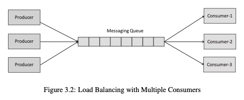
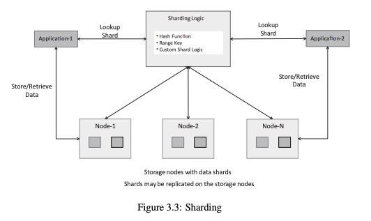
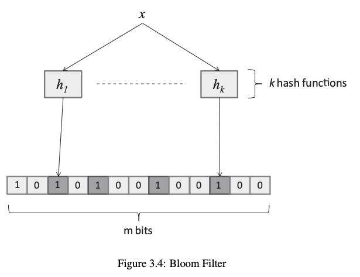
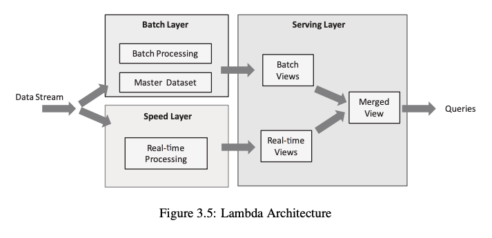
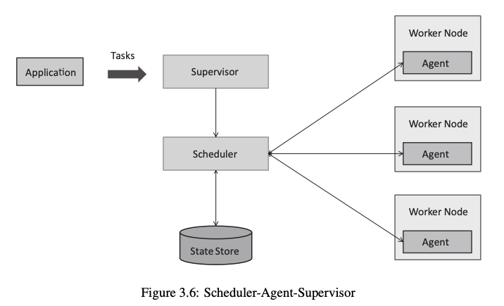
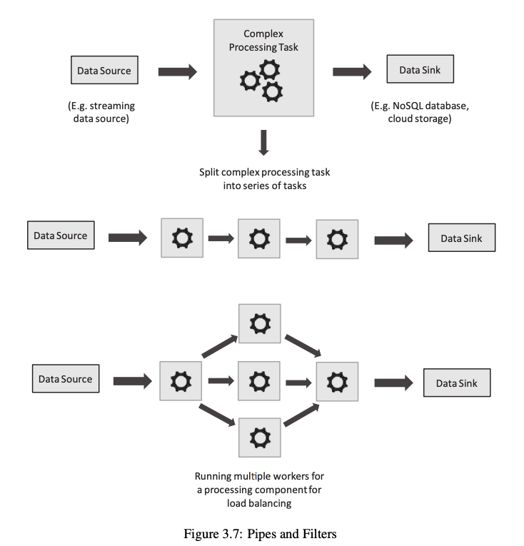
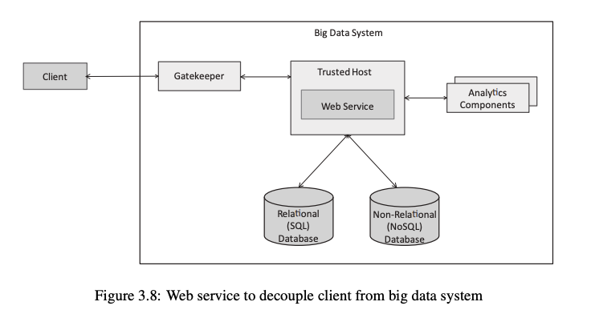
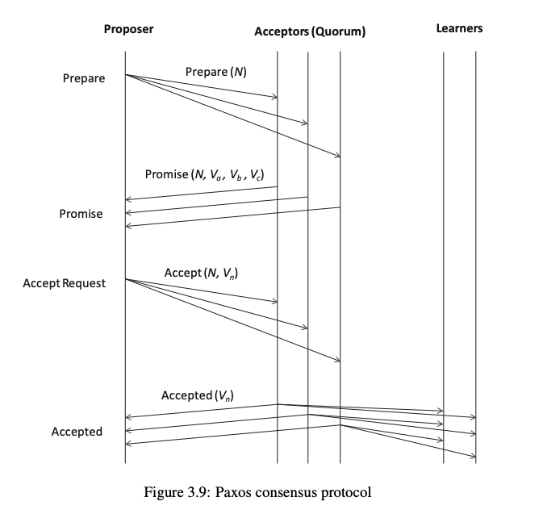
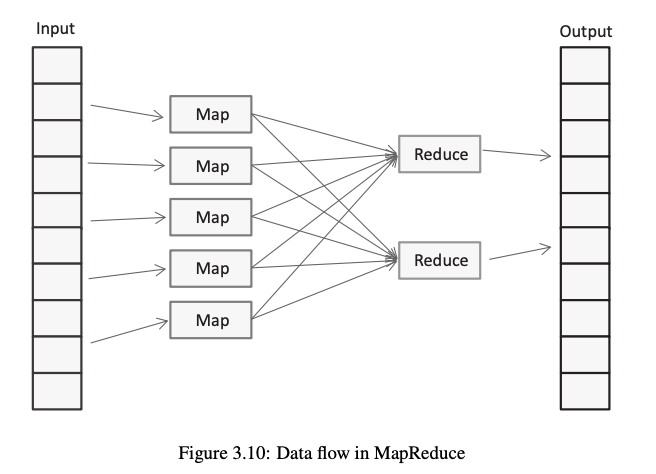
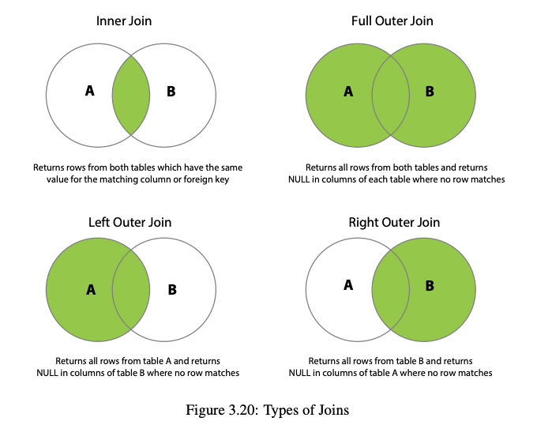

# Chapter 3: Distributed Systems Patterns

---

## Table of Contents

1. [Load Leveling with Queues](#1-load-leveling-with-queues)
2. [Load Balancing with Multiple Consumers](#2-load-balancing-with-multiple-consumers)
3. [Leader Election](#3-leader-election)
4. [Sharding](#4-sharding)
5. [CAP Theorem](#5-cap-theorem)
6. [Bloom Filter](#6-bloom-filter)
7. [Materialized View](#7-materialized-view)
8. [Lambda Architecture](#8-lambda-architecture)
9. [Scheduler–Agent–Supervisor](#9-scheduleragentsupervisor)
10. [Pipes and Filters](#10-pipes-and-filters)
11. [Web Service](#11-web-service)
12. [Consensus](#12-consensus)
13. [Paxos Algorithm](#13-paxos-algorithm)
14. [Multi-Paxos](#14-multi-paxos)
15. [MapReduce](#15-mapreduce)
16. [MapReduce Patterns](#16-mapreduce-patterns)
    - [Numerical Summarization](#numerical-summarization)
    - [Top-N Pattern](#top-n-pattern)
    - [Filter Pattern](#filter-pattern)
    - [Distinct Pattern](#distinct-pattern)
    - [Binning Pattern](#binning-pattern)
    - [Inverted Index](#inverted-index)
    - [Sorting Pattern](#sorting-pattern)
    - [Joins Pattern](#joins-pattern)

---

## 1. Load Leveling with Queues

> Uses a messaging queue placed between producer and consumer to smooth out workload spikes.

*Figure 3.2: Load Balancing with Multiple Consumers*

**Flow:** `Producer → Queue → Consumer`

| Category | Details |
|----------|---------|
| **Features** | Decoupling, Asynchronous processing, Buffering |
| **Benefits** | Prevents overload, Improves reliability, Scalable system |
| **Examples** | RabbitMQ, Amazon SQS |

**Important:**
- Queue stores data temporarily
- Consumers process at their own speed

---

## 2. Load Balancing with Multiple Consumers

> Multiple consumers process data from a single queue in parallel.

**Flow:** `Producer → Queue → Multiple Consumers`

| Category | Details |
|----------|---------|
| **Features** | Parallel processing, Scalable, Fault tolerant |
| **Benefits** | Faster processing, Improved reliability |

**Mechanism:**

| Step | Description |
|------|-------------|
| Pick | Message is hidden when picked by a consumer |
| Complete | Deleted after successful processing |
| Fail | Reprocessed if consumer fails |

**Important:**
- Visibility timeout ensures no data loss
- Messages are processed independently

---

## 3. Leader Election

> Process of selecting one node as the leader in a distributed system.

**Structure:** 1 Leader + Multiple Followers

| Category | Details |
|----------|---------|
| **Features** | Fault tolerance, Coordination, Reliability |
| **Key Points** | Avoids conflicts, Ensures proper control |
| **Tools** | ZooKeeper, etcd |

**Working:**
1. Nodes participate in election
2. Leader is selected
3. Followers execute tasks

**Failure Handling:** Leader fails → New election → New leader chosen

---

## 4. Sharding

> Splitting data into smaller parts (shards) distributed across nodes.

*Figure 3.3: Sharding*

**Working:** Data divided → Stored across nodes → Queries routed to shard

| Category | Details |
|----------|---------|
| **Features** | Horizontal scaling, Distributed storage |
| **Advantages** | Faster access, Scalable, Handles large datasets |
| **Challenges** | Complex setup, Data imbalance, Rebalancing needed |

**Types of Sharding:**

| Type | Description |
|------|-------------|
| Range-based | Data split by value ranges |
| Hash-based | Data split using a hash function |
| Directory-based | A lookup table maps data to shards |

**Key Points:** Improves performance · Used in distributed databases

---

## 5. CAP Theorem

> A distributed system can only guarantee 2 of the following 3 properties simultaneously.

**Properties:**

| Property | Description |
|----------|-------------|
| **Consistency (C)** | Same data across all nodes at all times |
| **Availability (A)** | System always responds to requests |
| **Partition Tolerance (P)** | System continues working during network failures |

**Combinations:**

| Combination | Guarantees | Sacrifices |
|-------------|-----------|------------|
| **CP** | Consistency + Partition Tolerance | Availability |
| **AP** | Availability + Partition Tolerance | Strict Consistency |
| **CA** | Consistency + Availability | Partition Tolerance |

**Key Points:**
- Cannot achieve all 3 simultaneously
- Real systems choose **CP** or **AP**
- Partition tolerance is considered essential in practice

---

## 6. Bloom Filter

> A probabilistic data structure used for fast membership checks.

*Figure 3.4: Bloom Filter*

**Working:**

| Step | Description |
|------|-------------|
| Structure | Uses a bit array + k hash functions |
| Insert | Hash the element → set corresponding bits to 1 |
| Query | Hash the element → check if all bits are 1 |

**Output:**

| Result | Meaning |
|--------|---------|
| **Definitely NOT present** | If any bit is 0 → element was never inserted |
| **Possibly present** | If all bits are 1 → element *might* be in the set |

| Category | Details |
|----------|---------|
| **Features** | Space efficient, Very fast |
| **Applications** | Caching, Databases, Duplicate detection |
| **Limitations** | False positives possible, No deletion (in basic form) |

**Key Points:** Never produces false negatives · Used in big data systems

---

## 7. Materialized View

> A precomputed, stored result of a database query.

**Difference from Normal View:**

| Type | Behaviour |
|------|-----------|
| Normal View | Query re-executed every time it is accessed |
| Materialized View | Result precomputed and stored; reused on access |

| Category | Details |
|----------|---------|
| **Features** | Fast queries, Reduced computation |
| **Refresh** | Required to update data — Manual or Automatic |
| **Use Cases** | Data warehouses, Reports |
| **Limitations** | Extra storage required, Data may become outdated |

**Key Points:** Improves query performance · Trade-off with data freshness

---

## 8. Lambda Architecture

> A data processing architecture that combines batch and real-time processing.

*Figure 3.5: Lambda Architecture*

**Layers:**

| Layer | Data Type | Characteristic |
|-------|-----------|----------------|
| **Batch Layer** | Historical data | High accuracy |
| **Speed Layer** | Real-time data | Low latency |
| **Serving Layer** | Combined results | Merged output for queries |

| Category | Details |
|----------|---------|
| **Features** | Scalable, Fault tolerant |
| **Advantages** | Fast + accurate, Handles big data |
| **Limitations** | Complex architecture, Duplicate processing logic |

**Key Points:**
- Batch = accuracy
- Speed = real-time
- Serving = output

---

## 9. Scheduler–Agent–Supervisor

> A pattern for distributed task scheduling, execution, and monitoring.

*Figure 3.6: Scheduler-Agent-Supervisor*

**Components:**

| Component | Role |
|-----------|------|
| **Supervisor** | Receives tasks from application, oversees system |
| **Scheduler** | Assigns tasks to agents, tracks state |
| **Agent** | Executes assigned tasks on worker nodes |

**Working:** Task assigned → Executed by Agent → Monitored by Supervisor → On failure → Reassigned

| Category | Details |
|----------|---------|
| **Features** | Distributed, Fault tolerant, Scalable |
| **Key Points** | Clear role separation, Ensures reliability |

---

## 10. Pipes and Filters

> An architectural pattern where data flows through a series of independent processing stages.

*Figure 3.7: Pipes and Filters*

**Components:**

| Component | Role |
|-----------|------|
| **Filter** | A processing unit that transforms or processes data |
| **Pipe** | A connector that transfers data between filters |

**Working:** `Input → Filter → Pipe → Filter → ... → Output`

| Category | Details |
|----------|---------|
| **Features** | Modular, Reusable, Flexible |
| **Advantages** | Easy to scale, Easy to modify |
| **Use Cases** | Data pipelines, ETL processes |
| **Key Points** | Independent components, Sequential processing |

---

## 11. Web Service

> A software system that provides data and functions over a network using standard protocols.

*Figure 3.8: Web service to decouple client from big data system*

**Flow:** `Client → Service → Backend`

**Types:**

| Type | Description |
|------|-------------|
| **REST** | Lightweight, uses HTTP methods |
| **SOAP** | XML-based, more rigid and formal |

| Category | Details |
|----------|---------|
| **Features** | Platform independent, Standard communication |
| **Use Cases** | Web apps, APIs, Cloud services |
| **Advantages** | Easy integration, Scalable |
| **Key Points** | Uses HTTP, Enables system communication |

---

## 12. Consensus

> A mechanism to achieve agreement among nodes in a distributed system.

**Working:**
1. Nodes propose values
2. Nodes communicate with each other
3. All nodes agree on a final value

| Category | Details |
|----------|---------|
| **Features** | Fault tolerant, Reliable |
| **Challenges** | Network issues, Node failures |
| **Algorithms** | Paxos, Raft |
| **Key Points** | Ensures consistency, Critical for distributed systems |

---

## 13. Paxos Algorithm

> A consensus algorithm designed to reach agreement in distributed systems even in the presence of failures.

*Figure 3.9: Paxos Consensus Protocol*

**Roles:**

| Role | Responsibility |
|------|---------------|
| **Proposer** | Proposes a value to be agreed upon |
| **Acceptor** | Accepts or rejects proposals (forms quorum) |
| **Learner** | Learns the final agreed value |

**Phases:**

| Phase | Action |
|-------|--------|
| **Prepare** | Proposer sends prepare request with proposal number N |
| **Promise** | Acceptors promise not to accept lower-numbered proposals |
| **Accept** | Proposer sends accept request with chosen value |
| **Accepted** | Acceptors accept the value; Learners are notified |

| Category | Details |
|----------|---------|
| **Key Points** | Majority quorum required, Unique proposal numbers, Fault tolerant |
| **Features** | Ensures consistency, Works with node failures |
| **Important** | No central control, Used for distributed agreement |

---

## 14. Multi-Paxos

> An optimized version of Paxos for agreeing on a sequence of multiple values efficiently.

**Key Idea:** Elects a stable leader to avoid repeating the Prepare phase for every value.

**Roles:**

| Role | Responsibility |
|------|---------------|
| **Leader** | Acts as the permanent Proposer |
| **Acceptors** | Accept values proposed by the leader |
| **Learners** | Learn the final results |

**Working:**

| Step | Description |
|------|-------------|
| 1 | Leader elected once |
| 2 | Prepare phase executed only once |
| 3 | Accept phase repeated for each new value |
| 4 | On leader failure → new leader elected |

| Category | Details |
|----------|---------|
| **Features** | Faster, Efficient, Fault tolerant |
| **Important** | Used in real systems, Significantly improves Paxos performance |

---

## 15. MapReduce

> A distributed data processing model for handling large datasets across a cluster.

*Figure 3.10: Data Flow in MapReduce*

**Flow:** `Input → Map → Shuffle → Reduce → Output`

**Phases:**

| Phase | Action |
|-------|--------|
| **Map** | Converts input data into key-value pairs |
| **Shuffle** | Groups all values by their key |
| **Reduce** | Aggregates grouped values to produce output |

| Category | Details |
|----------|---------|
| **Features** | Parallel, Scalable, Fault tolerant |
| **Advantages** | Handles big data, Distributed processing |
| **Limitations** | High latency, Not suitable for real-time |
| **Key Points** | Works on HDFS, Batch processing model |

---

## 16. MapReduce Patterns

### Numerical Summarization

> Computes aggregate statistics (Sum, Count, Avg, Min, Max) over a dataset.

| Step | Action |
|------|--------|
| Map | Emit key-value pairs for each record |
| Shuffle | Group all values by key |
| Reduce | Compute aggregate (sum, count, avg, etc.) |

| Category | Details |
|----------|---------|
| **Operations** | Sum, Count, Average, Min, Max |
| **Use Cases** | Log analysis, Data statistics |
| **Key Points** | Key-value based, Aggregation pattern |

---

### Top-N Pattern

> Finds the top N highest (or lowest) values from a large dataset.

| Step | Action |
|------|--------|
| Map | Compute local top N within each mapper |
| Shuffle | Combine local top N results |
| Reduce | Compute global top N from combined results |

| Category | Details |
|----------|---------|
| **Features** | Efficient, Reduces data transfer |
| **Optimization** | Local filtering at the mapper stage |
| **Use Cases** | Rankings, Leaderboards |
| **Key Points** | Partial sorting, Scalable |

---

### Filter Pattern

> Selects only records that satisfy a given condition.

| Step | Action |
|------|--------|
| Map | Apply filter condition; emit only matching records |
| Reduce | Optional (often not needed) |

| Category | Details |
|----------|---------|
| **Features** | Simple, Efficient |
| **Advantages** | Reduces data size, Faster downstream processing |
| **Use Cases** | Data cleaning, Filtering records |
| **Key Points** | Mostly mapper-based; early filtering improves performance |

---

### Distinct Pattern

> Finds all unique elements in a dataset by eliminating duplicates.

| Step | Action |
|------|--------|
| Map | Emit `(element, 1)` for each record |
| Shuffle | Group all entries by element key |
| Reduce | Output each key exactly once |

| Category | Details |
|----------|---------|
| **Features** | Removes duplicates, Uses key-based grouping |
| **Use Cases** | Unique IDs, Data cleaning |
| **Key Points** | One output per unique key |

---

### Binning Pattern

> Groups data values into defined ranges (bins/buckets) and counts occurrences.

| Step | Action |
|------|--------|
| Map | Assign each record to its bin |
| Shuffle | Group all records by bin |
| Reduce | Count the number of records per bin |

| Category | Details |
|----------|---------|
| **Features** | Converts raw data into a distribution, Simplifies analysis |
| **Use Cases** | Histograms, Age group analysis |
| **Key Points** | Range-based grouping, Count per bin |

---

### Inverted Index

> Maps each word to the list of documents in which it appears (used in search engines).

| Step | Action |
|------|--------|
| Map | Emit `(word, docID)` for each word in each document |
| Shuffle | Group all docIDs by word |
| Reduce | Output `(word, [doc1, doc2, ...])` |

| Category | Details |
|----------|---------|
| **Features** | Fast search, Scalable |
| **Use Cases** | Search engines, Text indexing |
| **Key Points** | Reverse mapping: Word → Documents |

---

### Sorting Pattern

> Sorts data across a distributed dataset using MapReduce's built-in shuffle ordering.

| Step | Action |
|------|--------|
| Map | Emit data with the sort key |
| Shuffle | Automatically sorts all key-value pairs by key |
| Reduce | Output records in sorted order |

**Types:**

| Type | Description |
|------|-------------|
| **Total Order** | All output is globally sorted across all reducers |
| **Partial Sorting** | Data is sorted within each reducer's partition |

| Category | Details |
|----------|---------|
| **Features** | Built-in sorting via shuffle, Efficient |
| **Use Cases** | Rankings, Data ordering |
| **Key Points** | Sorting happens in shuffle phase, Key-based |

---

### Joins Pattern

> Combines two or more datasets based on a common key, similar to SQL joins.

*Figure 3.20: Types of Joins*

| Step | Action |
|------|--------|
| Map | Emit `(key, tagged-value)` tagging which dataset each record comes from |
| Shuffle | Group all records sharing the same key |
| Reduce | Merge records from different datasets by key |

**Types:**

| Type | Description |
|------|-------------|
| **Reduce-side Join** | Joining happens in the reducer; works for any dataset size |
| **Map-side Join** | Joining happens in the mapper; requires one dataset to fit in memory |

**SQL Join Reference:**

| Join Type | Returns |
|-----------|---------|
| **Inner Join** | Only rows with matching keys in both tables |
| **Left Outer Join** | All rows from left table + matched rows from right (NULL if no match) |
| **Right Outer Join** | All rows from right table + matched rows from left (NULL if no match) |
| **Full Outer Join** | All rows from both tables (NULL where no match) |

| Category | Details |
|----------|---------|
| **Features** | Key-based merging, Scalable |
| **Use Cases** | Data integration, Analytics |
| **Key Points** | Same key → combine records |
