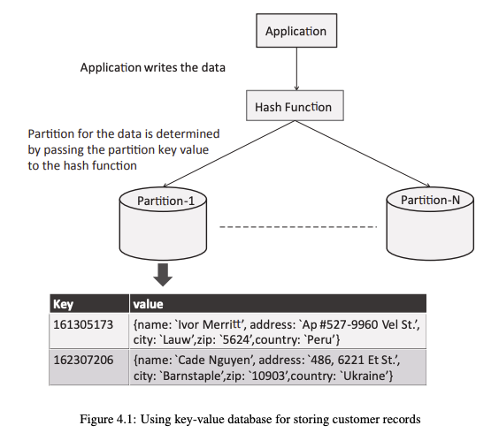
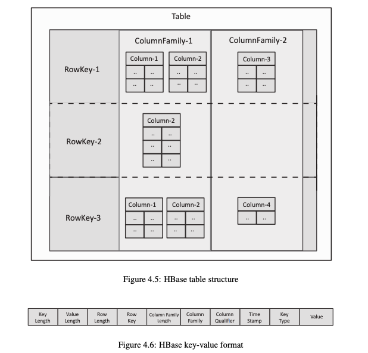
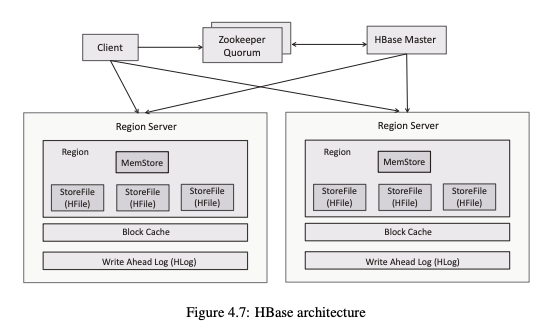

# NoSQL Databases — Complete Notes

---

## Table of Contents

1. [Introduction to NoSQL](#1-introduction-to-nosql)
2. [Key-Value Databases](#2-key-value-databases)
   - [Amazon DynamoDB](#21-amazon-dynamodb)
3. [Document Databases](#3-document-databases)
   - [MongoDB](#31-mongodb)
4. [Column Family Databases](#4-column-family-databases)
   - [HBase](#41-hbase)
5. [Graph Databases](#5-graph-databases)
   - [Neo4j](#51-neo4j)
6. [Comparison of NoSQL Databases](#6-comparison-of-nosql-databases)
7. [Summary](#7-summary)

---

## 1. Introduction to NoSQL

- **NoSQL** — Non-relational databases
- Used for **large-scale, unstructured data**

### Characteristics

- **Horizontal scaling** — add more machines instead of upgrading one
- **Schema-less** — no fixed table structure required
- **Distributed architecture** — data spread across multiple nodes
- **High performance** — optimized for fast operations

### Key Points

- Real-time performance is prioritized over consistency
- No fixed schema required
- Optimized for fast read/write operations

### Types of NoSQL Databases

| Type | Description |
|------|-------------|
| **Key-Value** | Stores data as key-value pairs |
| **Document** | Stores data as documents (JSON, XML, etc.) |
| **Column Family** | Stores data as columns grouped into families |
| **Graph** | Stores data as nodes and relationships |

### SQL vs NoSQL

| Feature | SQL (Structured Query Language) | NoSQL |
|---------|---------|-------|
| Structure | Structured, strict schema | Flexible, scalable |
| Data type | Tabular, relational | Varied (documents, graphs, etc.) |
| Scaling | Vertical | Horizontal |

---

## 2. Key-Value Databases

- Stores data as **(Key, Value)** pairs
- **Key** uniquely identifies the value

### Features

- Schema-less
- High scalability (distributed)
- Fast read/write
- Supports any data type in the value

### Hashing

- `hash(key)` → determines which partition stores the data
- Used for **load balancing** across nodes

### Limitations

- No complex queries supported
- Only **key-based access** — cannot query by value

### Use Cases

- Configuration data
- User sessions
- Shopping carts
- BLOB (Binary Large Object) storage

---

### 2.1 Amazon DynamoDB

- Fully managed NoSQL DB (Database) by **AWS (Amazon Web Services)**
- High performance + scalable

#### Data Model

```
Table → Items → Attributes
```

#### Primary Key

| Key Type | Description |
|----------|-------------|
| **Partition key** | Mandatory — used to determine storage partition |
| **Sort key** | Optional — used to sort items within a partition |

#### Key Concepts

- `hash(partition key)` → decides storage location
- No fixed schema — each item can have different attributes



*Figure 4.1: Using key-value database for storing customer records*

#### Operations

| Operation | Description |
|-----------|-------------|
| **Scan** | Reads the full table |
| **Query** | Uses the key for fast, targeted retrieval |

#### Other Features

- **Secondary index** — enables querying by non-key attributes
- Data is **replicated across availability zones** for durability

---

## 3. Document Databases

- Stores data as **documents** (JSON — JavaScript Object Notation, XML — Extensible Markup Language, BSON — Binary JSON)
- Handles **semi-structured data**

### Features

- Schema-less
- Flexible fields per document
- Supports **nested data** structures

### Key Concepts

- Each document has a **unique ID**
- Documents are grouped into **collections**

### Important Points

- Data is **denormalized** — related data stored together
- **No joins** required
- **Faster retrieval** compared to relational databases

### Advantage Over Key-Value

- Can **query inside the document** (not just by key)

### Use Cases

- eCommerce product catalogs
- Applications with flexible or evolving data structures

---

### 3.1 MongoDB

- Document-oriented NoSQL DB (Database)
- Stores **JSON (JavaScript Object Notation)-like documents**

#### Data Model

```
Database → Collection → Document
```

#### Features

- Schema-less
- Flexible document structure
- Horizontally scalable

#### Operations

| Operation | Command | Description |
|-----------|---------|-------------|
| Select DB (Database) | `use` | Switch to a database |
| Add document | `insert` | Insert a new document |
| Retrieve data | `find` | Query documents |

#### Important Points

- Supports querying **inside documents** (not just top-level fields)
- No joins required
- Data stored in **denormalized form**

#### Use Case

- eCommerce product storage with varying attributes per product

---

## 4. Column Family Databases

- Stores data as **columns** grouped into **column families**

### Structure

```
RowKey → Column Family → Columns
```

### Features

- Schema-less
- **Sparse storage** — only stores columns that exist for a row
- High throughput
- Distributed architecture

### Key Points

- Different rows can have different columns
- No joins required
- Only existing data is stored (sparse)

### Use Cases

- Large-scale data storage
- High-performance systems

---

### 4.1 HBase

- Distributed, scalable, column-family NoSQL DB (Database)
- Built on **HDFS (Hadoop Distributed File System)**
- Supports both structured and unstructured data

#### Data Model

```
Table → Rows → Column Families → Columns → Cells
```

| Element | Description |
|---------|-------------|
| **RowKey** | Unique identifier for a row |
| **Column Family** | Fixed at table creation time |
| **Columns** | Dynamic — can vary per row |
| **Cell** | Holds the actual value + timestamp |

#### Multi-dimensional Key

```
(Table, RowKey, ColumnFamily, Column, Timestamp)
```



*Figure 4.5: HBase table structure — showing how RowKeys map to Column Families and Columns, with sparse storage (RowKey-2 has only Column-2 in ColumnFamily-1)*

*Figure 4.6: HBase key-value format — internal row format: Key Length | Value Length | Row Length | Row Key | Column Family Length | Column Family | Column Qualifier | Time Stamp | Key Type | Value*

---

#### Key Features

| Feature | Description |
|---------|-------------|
| **Sparse** | Only stores existing columns — empty cells take no space |
| **Distributed** | Data split into regions across region servers |
| **Persistent** | Stored on HDFS (Hadoop Distributed File System) |
| **Sorted** | Rows sorted by RowKey |
| **Versioning** | Multiple values per cell using timestamps |

---

#### Architecture



*Figure 4.7: HBase architecture — Client communicates via Zookeeper Quorum to reach Region Servers. Each Region Server contains Regions with MemStore, StoreFiles (HFiles), Block Cache, and Write Ahead Log (HLog).*

##### Architecture Components

| Component | Role |
|-----------|------|
| **HMaster** | Manages metadata; assigns regions to region servers |
| **Region Server** | Stores actual data; handles read/write requests |
| **Region** | A subset of the table (a range of row keys) |
| **Zookeeper** | Coordination service; tracks active region servers |
| **HDFS (Hadoop Distributed File System)** | Underlying file system that stores HFiles |

##### Storage Components

| Component | Type | Description |
|-----------|------|-------------|
| **MemStore** | In-memory | Stores recent writes temporarily |
| **HFile** | Disk (HDFS) | Persistent storage; contains key-value pairs |
| **HLog / WAL (Write Ahead Log)** | Disk | Logs writes first to ensure durability |
| **Block Cache** | In-memory | Caches frequently accessed data for fast reads |

---

#### Read Path

```
1. Client → Zookeeper
2. Get ROOT table location
3. ROOT → META table
4. META → Region Server location
5. Client directly contacts Region Server
```

> Metadata is **cached** after first lookup for faster future reads.

---

#### Write Path

```
1. Write → HLog (WAL — Write Ahead Log)
2. Write → MemStore (in-memory)
3. MemStore full → flushed → HFile (on disk)
```

---

#### LSM (Log-Structured Merge) Tree

- **MemStore** → in-memory tree (recent writes)
- **HFile** → disk tree (persisted data)
- When MemStore is full → **merge** to HFile

**Advantages:**
- Converts random writes → sequential writes
- High write performance

---

#### Compaction

| Type | Description |
|------|-------------|
| **Minor Compaction** | Merges small HFiles into larger ones |
| **Major Compaction** | Merges all HFiles; removes old and deleted data |

---

#### Bloom Filter

- Checks if data **may exist** in an HFile before reading it
- **Avoids unnecessary disk reads**
- **No false negatives** — if it says absent, data is definitely absent
- **Possible false positives** — may say present when data isn't

---

#### Operations

| Operation | Description |
|-----------|-------------|
| **Get** | Retrieves a single row |
| **Scan** | Reads a range of rows |
| **Put** | Inserts or updates a row |
| **Delete** | Adds a **Tombstone** marker (actual data removed during compaction) |

#### Important Points

- **No overwrite** — a new version is added instead of replacing old data
- Data stored as **byte arrays**
- Supports **millions of columns** per row
- Designed as a **high throughput** system

---

## 5. Graph Databases

- Stores data as **nodes** and **relationships**
- Uses a **graph structure**

### Components

| Component | Description |
|-----------|-------------|
| **Node** | Represents an entity (e.g., a person, product) |
| **Edge** | Represents a relationship between nodes |
| **Properties** | Key-value pairs attached to nodes or edges |

### Relationship Types

| Type | Description |
|------|-------------|
| **Directed** | One-way relationship (A → B) |
| **Undirected** | Two-way relationship (A ↔ B) |

### Concepts

- **Path** — a sequence of connected nodes and edges

### Advantages

- No joins required
- Fast relationship queries
- Efficient graph traversal

### SQL vs Graph

| Feature | SQL (Structured Query Language) | Graph DB |
|---------|---------|----------|
| Structure | Tables + Joins | Nodes + Edges |
| Relationship queries | Slow (multiple joins) | Fast (direct traversal) |

### Use Cases

- Social networks
- Recommendation systems
- Network analysis

### Key Insight

- Relationships are **stored explicitly** alongside the data
- Querying relationships is **faster than relational DB (Database)**

---

### 5.1 Neo4j

- Graph database using nodes and relationships
- Supports **ACID** properties:

| ACID Property | Full Form | Description |
|---------------|-----------|-------------|
| **A** | Atomicity | All-or-nothing execution — either all operations succeed or none do |
| **C** | Consistency | Rules-based validity — database remains in a valid state |
| **I** | Isolation | Independent execution — transactions don't interfere with each other |
| **D** | Durability | Permanent, logged changes — committed data is not lost |

#### Data Model

| Element | Description |
|---------|-------------|
| **Node** | Represents an entity |
| **Relationship** | Connection between two nodes |
| **Properties** | Key-value pairs on nodes or relationships |

#### Cypher (Neo4j Query Language)

| Command | Purpose |
|---------|---------|
| `CREATE` | Add nodes or relationships |
| `MATCH` | Query and retrieve data |

#### Features

- Fast relationship queries
- No joins required

#### Use Cases

- Social networks
- Recommendation systems

---

## 6. Comparison of NoSQL Databases

### Data Model

| Type | Data Model |
|------|------------|
| **Key-Value** | Key-value pairs |
| **Document** | JSON (JavaScript Object Notation) documents |
| **Column Family** | Columns + column families |
| **Graph** | Nodes + edges |

### Querying

| Type | Query Method |
|------|-------------|
| **Key-Value** | By key only |
| **Document** | By attributes inside the document |
| **Column Family** | By row key |
| **Graph** | Cypher query language |

### Use Cases

| Type | Best For |
|------|----------|
| **Key-Value** | Simple, fast access (sessions, caching) |
| **Document** | Flexible, evolving data |
| **Column Family** | Big data and high throughput |
| **Graph** | Relationship-heavy queries |

### Examples

| Type | Example DB (Database) |
|------|------------|
| Key-Value | **Amazon DynamoDB** |
| Document | **MongoDB** |
| Column Family | **HBase** |
| Graph | **Neo4j** |

---

## 7. Summary

- **NoSQL** — Non-relational databases used for large, unstructured data
- **Core Idea:** Performance + scalability over strict consistency

### Types Recap

| Type | Key Strength |
|------|-------------|
| **Key-Value** | Simple, fast storage and retrieval |
| **Document** | Flexible JSON (JavaScript Object Notation) data with internal querying |
| **Column Family** | High throughput for big data |
| **Graph** | Fast relationship traversal |

### Common Features Across All NoSQL Types

- **Schema-less** — no fixed structure required
- **Distributed** — data spread across multiple nodes
- **Horizontally scalable** — scale by adding more machines

---

*End of Notes*
