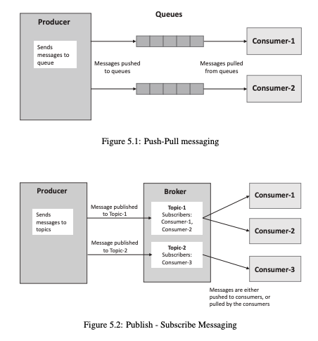
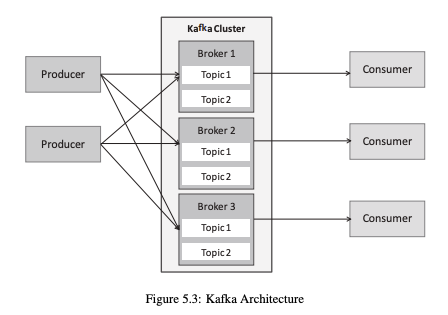
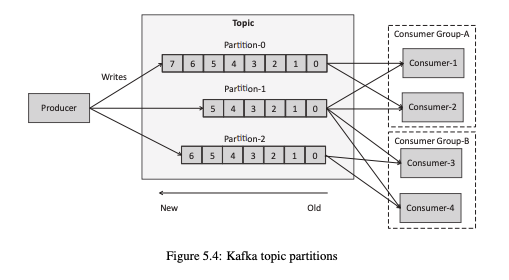
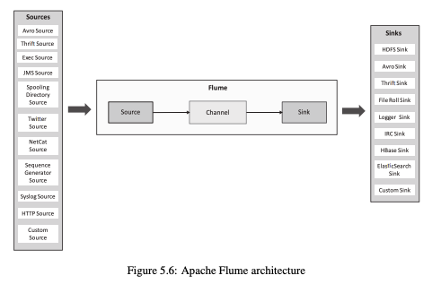
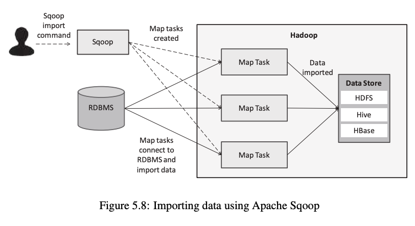
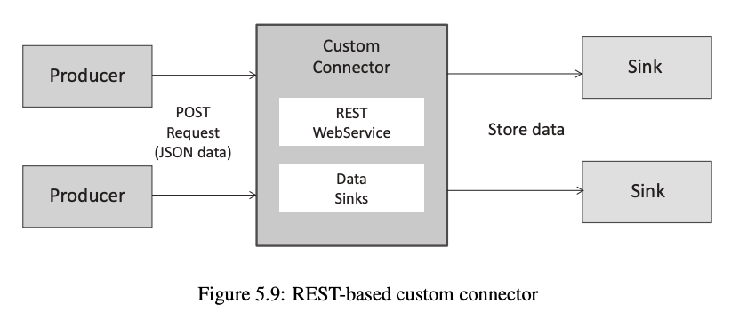
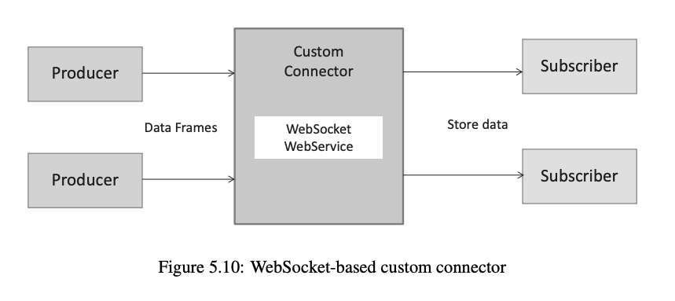

# Data Acquisition & Messaging Systems — Complete Notes

---

## Table of Contents

1. [Data Acquisition Considerations](#1-data-acquisition-considerations)
2. [Publish–Subscribe Messaging Frameworks](#2-publishsubscribe-messaging-frameworks)
   - [Apache Kafka](#apache-kafka)
3. [Big Data Collection Systems](#3-big-data-collection-systems)
   - [Apache Flume](#apache-flume)
   - [Apache Sqoop](#apache-sqoop)
4. [Messaging Queues](#4-messaging-queues)
   - [AMQP](#amqp-advanced-message-queuing-protocol)
   - [RabbitMQ](#rabbitmq)
   - [ZeroMQ](#zeromq-zmtp)
   - [RestMQ](#restmq)
5. [Custom Connectors](#5-custom-connectors)

---

## 1. Data Acquisition Considerations

- **Data Acquisition** — Process of collecting data from multiple sources and transferring it to storage/processing systems (HDFS — Hadoop Distributed File System, DB — Database, etc.)
- It is the **first step** in the Big Data pipeline

---

### Source Type

Defines the nature of the data source.

| Type | Description | Examples |
|------|-------------|---------|
| **Batch** | Data generated in chunks, processed periodically | Files, logs, databases |
| **Streaming** | Continuous data generation, requires real-time processing | Sensors, IoT (Internet of Things), social media |

---

### Velocity

Speed at which data is generated.

| Type | Description | Examples |
|------|-------------|---------|
| **Low Velocity** | Slow data generation | Daily reports, backups |
| **High Velocity** | Continuous real-time data | IoT devices, live feeds |

**Requirements for High Velocity:**
- Low latency
- Fast ingestion systems
- High throughput tools (Kafka, MQTT — Message Queuing Telemetry Transport)

---

### Ingestion Mechanism

Method of transferring data from producer → consumer.

| Type | Description | Example | Notes |
|------|-------------|---------|-------|
| **Push** | Producer sends data directly to consumer | Flume | Simple but less control |
| **Pull** | Consumer fetches data when needed | Kafka | More control, efficient |
| **Publish–Subscribe (Pub-Sub)** | Producer → Topic → Multiple consumers | Kafka | Scalable and flexible |

---

### Key Points

- Source type decides ingestion method
- High velocity → need real-time tools
- Push vs Pull → based on control and system design
- Pub-Sub → best for scalability

---

## 2. Publish–Subscribe Messaging Frameworks

- **Publish–Subscribe** — Messaging model where producers send data to topics and consumers subscribe to those topics
- Uses a **broker** to manage communication



*Figure 5.1: Push-Pull messaging — Producer pushes messages to queues; consumers pull from queues*
*Figure 5.2: Publish-Subscribe messaging — Producer publishes to topics on a Broker; consumers subscribe to specific topics*

---

### Components

| Component | Role |
|-----------|------|
| **Publisher** | Produces and sends messages to topics |
| **Broker** | Manages topics and handles message delivery |
| **Consumer** | Subscribes to topics and receives messages |
| **Topic** | Logical channel for data flow |

**Flow:** `Publisher → Broker → Topic → Consumers`

---

### Features

| Feature | Description |
|---------|-------------|
| **Decoupled** | Producer and consumer are independent of each other |
| **Scalable** | Multiple consumers can subscribe to one topic |
| **Asynchronous** | No need for simultaneous communication |
| **Flexible** | Easy to add or remove consumers |

**Key Points:**
- One message → delivered to multiple consumers
- Supports real-time data streaming
- Basis for systems like Apache Kafka

---

### Apache Kafka

- Distributed, high-throughput messaging system
- Based on the publish–subscribe model
- Acts as a **distributed commit log**

---

#### Core Components

| Component | Description |
|-----------|-------------|
| **Producer** | Sends messages to topics |
| **Consumer** | Reads messages from topics |
| **Broker** | Kafka server — stores data and manages replication |
| **Topic** | Logical stream/category of messages |

---

#### Architecture



*Figure 5.3: Kafka Architecture — Multiple Producers send data to a Kafka Cluster of Brokers (each holding Topic partitions); Consumers read from the brokers.*

- **Kafka Cluster** — Group of brokers
- **Brokers** — Store partitions of topics
- **Topics** — Distributed across multiple brokers

---

#### Partitions

- A topic is divided into multiple **partitions**
- Each partition is:
  - **Ordered** — messages are in sequence
  - **Immutable** — append-only log (no edits)

**Advantages of Partitions:**
- Parallel processing
- High scalability
- High throughput



*Figure 5.4: Kafka topic partitions — A Producer writes to 3 partitions (Partition-0, 1, 2); Consumer Group-A (Consumer-1, 2) and Consumer Group-B (Consumer-3, 4) read from them independently.*

---

#### Offsets

- **Offset** — Unique ID for each message within a partition
- Maintained by the **consumer**
- Uses:
  - Track consumption progress
  - Resume reading from a specific point
  - **Replay messages** (re-read old data)

---

#### Producers

- Publish messages to topics
- **Partitioning strategies:**

| Strategy | Description |
|----------|-------------|
| **Round Robin** | Balanced distribution across all partitions |
| **Key-based** | Same key → always sent to same partition (ensures ordering) |

---

#### Consumers & Consumer Groups

- **Consumer** — reads messages from topics
- **Consumer Group** — multiple consumers acting as one logical group
- Each partition is assigned to **one consumer** within a group

**Advantages:**
- Parallelism
- Load balancing
- Fault tolerance

---

#### Message Storage (Commit Log)

- Messages stored as **append-only logs on disk**
- Messages are **retained** (not immediately deleted after consumption)
- **Configurable retention** period
- Enables **replay** of data

---

#### Replication

- Partitions are **replicated across brokers** for fault tolerance

| Role | Description |
|------|-------------|
| **Leader** | Handles all read/write for a partition |
| **Follower** | Replicates data from the leader |

**Benefits:** Fault tolerance + High availability

---

#### Log Cleanup

| Type | Description |
|------|-------------|
| **Delete** | Removes old data after retention period |
| **Compact** | Keeps only the latest value per key |

---

#### Ordering

- **Guaranteed within a partition**
- **Not guaranteed across partitions**

---

#### Key Features Summary

- High throughput
- Low latency
- Distributed
- Fault tolerant
- Horizontally scalable

#### Use Cases

- Stream processing
- Log aggregation
- Monitoring systems
- Real-time analytics
- Website activity tracking

---

#### ⚠️ Important Exam Points

- Kafka ≠ traditional queue — messages are **retained** after consumption
- Uses **offset-based** consumption (not destructive reads)
- Supports **message replay**
- **Partitioning** is the core scalability feature
- Ordering is guaranteed **within** a partition only

---

## 3. Big Data Collection Systems

### Apache Flume

- Distributed data ingestion system
- Collects, aggregates, and moves large volumes of data
- Mainly used for **log and streaming data ingestion into HDFS (Hadoop Distributed File System) / HBase**

---

#### Architecture

```
Source → Channel → Sink
```

- **Agent** = combination of Source + Channel + Sink



*Figure 5.6: Apache Flume architecture — Data flows from various Sources (Avro, Thrift, Exec, JMS, Syslog, HTTP, etc.) through a Channel into Sinks (HDFS, Avro, Thrift, HBase, ElasticSearch, Custom, etc.)*

---

#### Components

| Component | Description | Examples |
|-----------|-------------|---------|
| **Source** | Collects data from external sources | Logs, APIs, social media |
| **Channel** | Temporary buffer — stores events before sending to sink | Memory, File, Spillable Memory |
| **Sink** | Transfers data to destination | HDFS, HBase |
| **Event** | Basic unit of data — contains payload + headers | — |

---

#### Data Flow

```
Source collects data → sends to Channel → Channel buffers → Sink writes to destination
```

---

#### Features

- Distributed and scalable
- Reliable — supports fault tolerance
- High throughput
- Supports real-time data ingestion

---

#### Channel Types

| Channel | Description |
|---------|-------------|
| **Memory Channel** | Fast but risk of data loss on failure |
| **File Channel** | Disk-based, reliable |
| **Spillable Memory Channel** | Hybrid — uses memory first, spills to disk when full |

---

#### Advanced Concepts

- Supports **multiple sources and sinks** in one agent
- **Channel Selectors:**

| Type | Description |
|------|-------------|
| **Replicating** | Sends event to all channels |
| **Multiplexing** | Routes event to specific channel based on condition |

- **Interceptors** — Modify or filter data in-flight (e.g., add timestamp, hostname)
- **Sink Processors:**
  - **Load balancing** — distributes load across multiple sinks
  - **Failover handling** — switches to backup sink on failure

#### Use Cases

- Log collection systems
- Real-time data ingestion into Hadoop

---

### Apache Sqoop

- Tool for transferring **bulk structured data**
- Works between **RDBMS (Relational Database Management System)** and the **Hadoop ecosystem**

---

#### Data Transfer Direction

| Direction | Description |
|-----------|-------------|
| **Import** | RDBMS → HDFS / Hive / HBase |
| **Export** | Hadoop → RDBMS |

---

#### Working

1. Connects to the database
2. Reads metadata (schema, column names)
3. Splits data into chunks
4. Uses **MapReduce** for parallel transfer



*Figure 5.8: Sqoop import — User issues import command → Sqoop creates Map Tasks → Map Tasks connect to RDBMS and import data in parallel → Data stored in HDFS / Hive / HBase*

---

#### Features

- **Parallel data transfer** using MapReduce
- Scalable and efficient
- Fault tolerant
- Supports multiple databases

---

#### Connectors

Used to connect to different databases. Examples:
- MySQL
- Oracle
- PostgreSQL

---

#### Incremental Import

Transfers only **new or updated data** (not the full dataset every time).

| Type | Description |
|------|-------------|
| **Append** | Adds only new rows |
| **Last Modified** | Transfers rows updated since last import |

---

#### Supported Data Formats

- Text
- Sequence files
- Avro
- Parquet

---

#### Key Points

- Used **only for structured data**
- Faster than manual data transfer
- Automates data movement between RDBMS and Hadoop

#### Use Case

- Move enterprise database data → Hadoop for analytics

---

## 4. Messaging Queues

- System for **asynchronous** communication between producer and consumer
- Messages stored in a queue until processed

**Flow:** `Producer → Queue → Consumer`

---

### Features

| Feature | Description |
|---------|-------------|
| **Decoupled** | Producer and consumer are independent |
| **Asynchronous** | Both don't need to be active at the same time |
| **Reliable** | Messages stored until successfully delivered |
| **Scalable** | Can handle multiple producers and consumers |
| **Load Balancing** | Distributes messages among available consumers |

---

### AMQP (Advanced Message Queuing Protocol)

- Standard messaging protocol
- Defines rules for message exchange between systems

#### Components

| Component | Description |
|-----------|-------------|
| **Exchange** | Receives messages from producer and routes them |
| **Queue** | Stores messages until consumed |
| **Binding** | Links an exchange to a queue |

**Flow:** `Producer → Exchange → Queue → Consumer`

#### Features

- Reliable delivery
- Flexible routing types: **Direct**, **Topic**, **Fanout**
- Interoperability between different systems/languages

---

### RabbitMQ

- Message broker that implements AMQP (Advanced Message Queuing Protocol)

#### Features

- Reliable messaging
- Supports multiple exchange types
- **Message acknowledgment** — ensures delivery confirmation
- Flexible routing
- Easy to deploy

#### Working

1. Producer sends message to exchange
2. Exchange routes message to appropriate queue
3. Consumer reads from the queue

---

### ZeroMQ (ZMTP)

- High-performance messaging **library** (not a traditional broker)
- Uses **ZMTP (ZeroMQ Message Transfer Protocol)**

#### Features

- **Brokerless** — peer-to-peer direct communication (no central server)
- Very low latency
- High throughput
- Lightweight

#### Supported Patterns

- Request-Reply
- Publish-Subscribe
- Pipeline

> **Key Point:** No central queue → direct communication between nodes

---

### RestMQ

- Messaging system using **REST (Representational State Transfer) over HTTP (HyperText Transfer Protocol)**

#### Features

- Uses HTTP protocol
- Simple integration with web applications
- Stateless communication

#### Limitations

- Higher latency than Kafka/ZeroMQ
- Less efficient for real-time systems

---

### Messaging Queue Comparison

| Feature | RabbitMQ | ZeroMQ | RestMQ |
|---------|----------|--------|--------|
| Architecture | Broker-based | Brokerless | HTTP-based |
| Speed | Reliable | Fastest | Moderate |
| Protocol | AMQP | ZMTP | REST/HTTP |
| Use case | Enterprise messaging | High-performance | Web integration |

---

### ⚠️ Important Exam Points

- Messaging queue ensures **decoupling + async processing**
- AMQP defines the **standard communication model**
- **RabbitMQ** = practical implementation of AMQP
- **ZeroMQ ≠ traditional queue** (no broker, no central queue)
- **RestMQ** uses HTTP for messaging

---

## 5. Custom Connectors

- Used to **connect data sources** (apps, devices, APIs) to data processing systems
- Enable data ingestion using different communication protocols
- Important for integrating **real-time and distributed systems**

---

### REST (Representational State Transfer)-based Connectors

- Use **HTTP (HyperText Transfer Protocol)** protocol
- Follow **request–response** model

#### HTTP Methods

| Method | Action |
|--------|--------|
| `GET` | Retrieve data |
| `POST` | Send data |
| `PUT` | Update data |
| `DELETE` | Remove data |

#### Features

- Stateless communication
- Simple and widely used
- Easy integration with web services

#### Limitations

- **Not real-time** — requires repeated requests (polling)
- Higher latency compared to streaming



*Figure 5.9: REST-based custom connector — Producers send POST requests with JSON data to a Custom Connector (REST WebService + Data Sinks), which stores data to Sinks*

---

### WebSocket-based Connectors

- Provide **full-duplex (two-way)** communication
- Maintain a **persistent connection** between client and server

#### Features

- Real-time data transfer
- Low latency
- Continuous communication (no repeated requests)

#### Advantages over REST

- No repeated requests needed
- Faster than REST for live data

#### Use Cases

- Chat applications
- Live notifications
- Online gaming



*Figure 5.10: WebSocket-based custom connector — Producers send Data Frames to a Custom Connector (WebSocket WebService), which stores data to Subscribers*

---

### MQTT (Message Queuing Telemetry Transport)-based Connectors

- Lightweight messaging protocol
- Based on **publish–subscribe** model
- Designed for constrained devices and unreliable networks

#### Features

- Low bandwidth usage
- Energy efficient
- Works well on unreliable networks

#### Components

| Component | Role |
|-----------|------|
| **Publisher** | Sends data to broker |
| **Broker** | Manages communication between publisher and subscribers |
| **Subscriber** | Receives data from broker |

#### Use Cases

- IoT (Internet of Things) devices
- Sensors
- Smart home systems

---

### Amazon IoT (Internet of Things)

- AWS (Amazon Web Services) cloud platform for IoT

#### Features

- Connects and manages IoT devices
- Secure communication
- Scalable data ingestion

#### Functions

- Device communication
- Data collection
- Integration with AWS services (Lambda, S3, DynamoDB, etc.)

---

### Azure IoT Hub

- Microsoft cloud platform for IoT

#### Features

- Secure device connectivity
- Device management at scale
- Real-time data ingestion

#### Functions

- Monitor devices remotely
- Collect and process telemetry data
- Integrate with Azure services (Stream Analytics, Event Hub, etc.)

---

### Custom Connector Comparison

| Feature | REST | WebSocket | MQTT | Amazon IoT / Azure IoT |
|---------|------|-----------|------|------------------------|
| Communication | Request-Response | Full-duplex, persistent | Pub-Sub | Cloud-managed |
| Latency | Higher | Low | Low | Varies |
| Real-time | No | Yes | Yes | Yes |
| Best for | Web APIs | Live apps | IoT devices | Enterprise IoT |
| Protocol | HTTP | WS / WSS | MQTT | MQTT / HTTPS |

---

### ⚠️ Important Exam Points

- **REST ≠ real-time** — it is request-based (polling)
- **WebSocket** = real-time, continuous, full-duplex communication
- **MQTT** = lightweight pub-sub, best suited for IoT
- **Amazon IoT / Azure IoT** provide end-to-end device management + data processing

---

*End of Notes*
