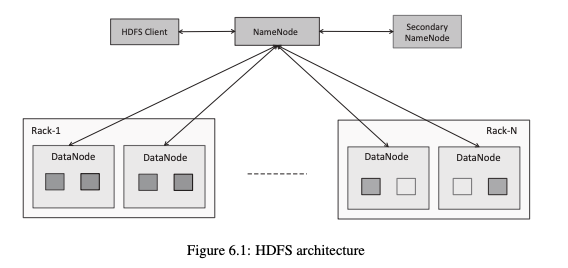
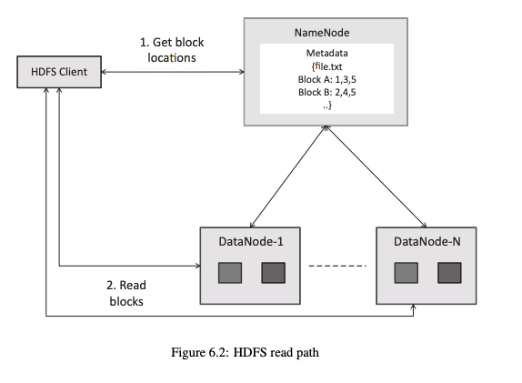
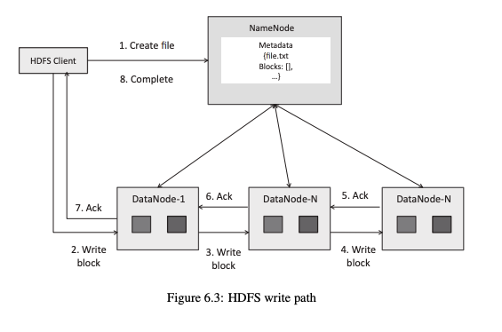

# HDFS (Hadoop Distributed File System) — Complete Notes

---

## Table of Contents

1. [Introduction to HDFS](#1-introduction-to-hdfs)
2. [HDFS Architecture](#2-hdfs-architecture)
3. [HDFS Read Path](#3-hdfs-read-path)
4. [HDFS Write Path](#4-hdfs-write-path)

---

## 1. Introduction to HDFS

- **HDFS (Hadoop Distributed File System)** — Distributed file system designed for big data storage
- Runs on a **cluster of commodity machines**

---

### Storage

| Parameter | Value |
|-----------|-------|
| **Block size** | 64 MB (default) |
| **Replication factor** | 3 (default) |

- Files are **split into blocks** and distributed across nodes
- Each block is replicated across multiple DataNodes

---

### Features

- **Scalable** — handles terabytes (TBs) to petabytes of data
- **Fault tolerant** — achieved through block replication
- **High throughput** — optimized for large sequential reads
- **Distributed storage** — data spread across the cluster

---

### Characteristics

- **Streaming data access** — optimized for batch reads, not random access
- **Write once, read many** — files are written once and read multiple times
- **Supports file append** — allows appending to existing files

---

### Key Points

- **Not suitable for low latency** operations (use HBase for that)
- Data stored across multiple nodes
- Replication ensures reliability and availability

---

## 2. HDFS Architecture

- Follows **Master-Slave architecture**



*Figure 6.1: HDFS architecture — HDFS Client communicates with the NameNode; NameNode coordinates with Secondary NameNode and manages multiple DataNodes spread across Rack-1 to Rack-N*

---

### Components

| Component | Role |
|-----------|------|
| **NameNode** | Master — stores metadata, manages the filesystem namespace |
| **Secondary NameNode** | Performs checkpointing — merges fsimage + edits log periodically |
| **DataNode** | Slave — stores actual data blocks; sends heartbeat and block report to NameNode |
| **Client** | Interacts with the system to read/write data |

---

### Metadata

| File | Description |
|------|-------------|
| **fsimage** | A snapshot of the entire filesystem namespace at a point in time |
| **edits** | A log of all changes (updates) made since the last snapshot |

> The **Secondary NameNode** merges fsimage + edits to create a new fsimage, reducing NameNode startup time. It is **not** a backup/failover NameNode.

---

### Data Storage

- Files split into **blocks** (default 64 MB each)
- Blocks **replicated** across DataNodes (default factor = 3)

---

### Rack Awareness

- Replicas are stored across **different racks**, not just different nodes
- Improves **fault tolerance** — a full rack failure doesn't cause data loss
- Typically: 2 replicas on same rack, 1 replica on a different rack

---

### Key Points

- **NameNode ≠ data storage** — it only stores metadata (block locations, file info)
- **DataNodes** handle the actual data storage
- Replication ensures reliability

---

## 3. HDFS Read Path

- Process of **reading data** from HDFS



*Figure 6.2: HDFS read path — Client requests block locations from NameNode (which holds metadata like Block A: 1,3,5 and Block B: 2,4,5); Client then reads blocks directly from DataNodes*

---

### Steps

```
1. Client → NameNode    : Request block locations for the file
2. NameNode → Client    : Returns list of block locations (DataNode addresses)
3. Client → DataNodes   : Reads data blocks directly
4. DataNodes → Client   : Stream data back to client
```

---

### Optimization

- **Nearest DataNode selected** — client reads from the closest DataNode (by network topology)
- Reduces network traffic and improves read speed

---

### Fault Tolerance

- Multiple replicas available across DataNodes
- If one DataNode fails during read, client automatically **switches to another replica**

---

### Key Points

- **No data flows through NameNode** — NameNode only provides metadata
- Data is read **directly from DataNodes**
- Blocks are read **sequentially**
- High throughput reading for large files

---

## 4. HDFS Write Path

- Process of **writing data** to HDFS



*Figure 6.3: HDFS write path — Client sends create file request to NameNode; NameNode assigns block locations; Client writes blocks through a pipeline (DataNode-1 → DataNode-N → DataNode-N); ACKs flow back through the pipeline; NameNode notified of completion*

---

### Steps

```
1. Client → NameNode    : Request to create file
2. NameNode → Client    : Validates request, checks permissions
3. Client              : Splits data into packets
4. NameNode → Client    : Provides block locations (DataNode addresses)
5. Client → DataNodes   : Sends data packets to first DataNode
```

---

### Pipeline Replication

- Data is written through a **pipeline** across DataNodes:

```
Client → DN1 (DataNode 1) → DN2 (DataNode 2) → DN3 (DataNode 3)
```

- Each DataNode forwards the block to the next in the pipeline
- Ensures **all replicas** are written in one pass

---

### Acknowledgment (ACK)

- **ACK (Acknowledgment)** sent back from each DataNode in reverse order
- DN3 → DN2 → DN1 → Client
- Ensures **successful write** at each DataNode before proceeding
- After all blocks written, client notifies NameNode → **write complete**

---

### Key Points

- Data is written in **blocks**
- Replication handled **automatically** by the pipeline
- Pipeline improves write efficiency

---

### Fault Tolerance

- Multiple replicas created across DataNodes
- If a DataNode **fails during write**, a new pipeline is created and writing continues
- NameNode detects failure via missing heartbeat and re-replicates blocks as needed

---

### Important

- **NameNode handles metadata only** — it never handles actual data
- **Data flows directly to DataNodes** — not through NameNode

---

*End of Notes*
