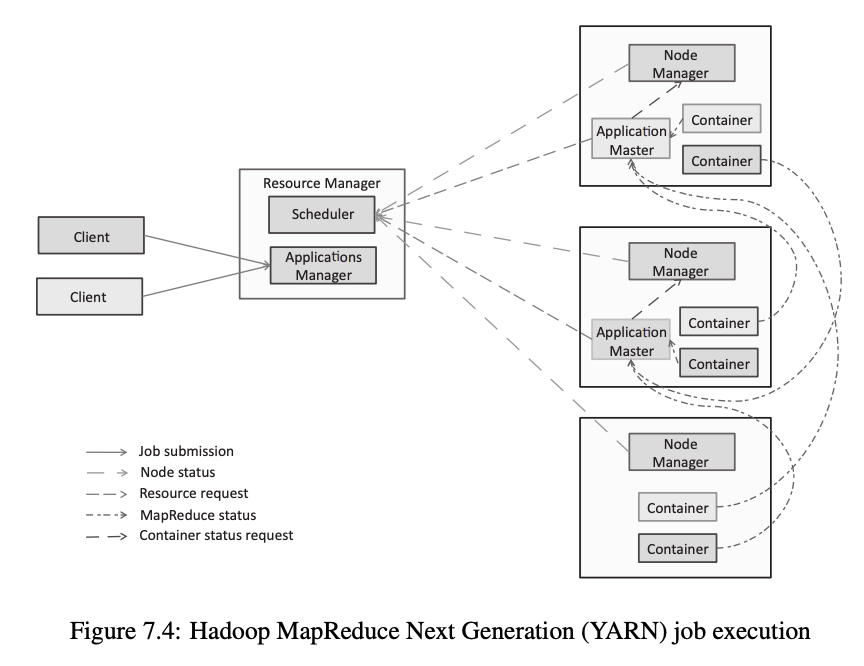
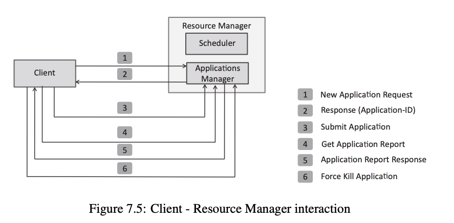
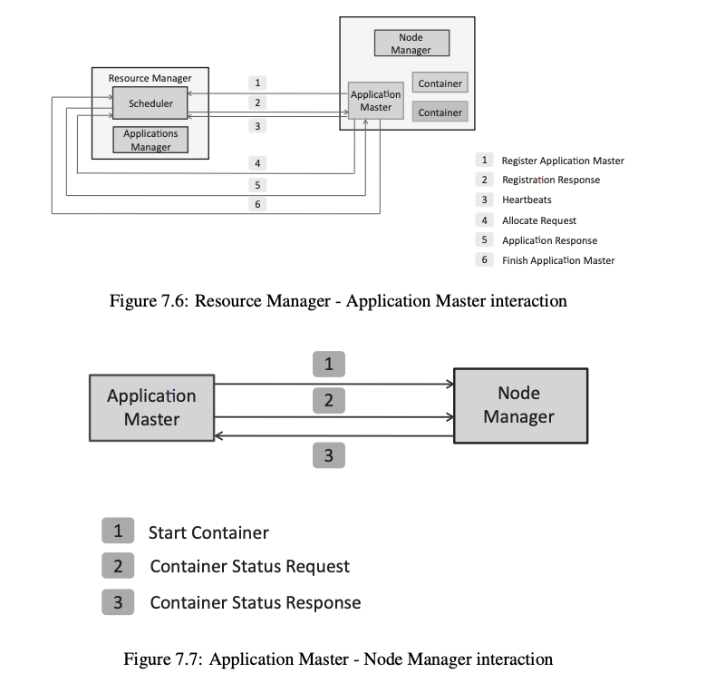
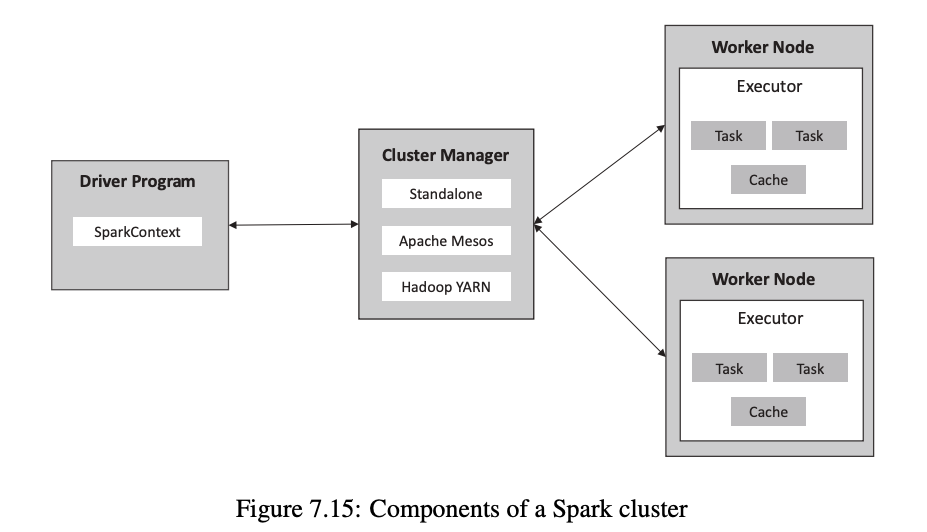

# Hadoop Ecosystem & Big Data Processing — Complete Notes

---

## Table of Contents

1. [Hadoop and MapReduce](#1-hadoop-and-mapreduce)
2. [Hadoop YARN](#2-hadoop-yarn-yet-another-resource-negotiator)
3. [Hadoop Schedulers](#3-hadoop-schedulers)
4. [Apache Pig](#4-apache-pig)
5. [Apache Oozie](#5-apache-oozie)
6. [Apache Spark Search](#6-apache-spark-search)
7. [Apache Solr](#7-apache-solr)
8. [Stream Processing](#8-stream-processing)
9. [Apache Storm](#9-apache-storm)
10. [In-Memory Processing](#10-in-memory-processing)
11. [Apache Spark](#11-apache-spark)

---

## 1. Hadoop and MapReduce

- **Hadoop** — Open-source framework for big data storage and processing
- Uses **distributed storage + distributed processing** across a cluster

---

### MapReduce

- **MapReduce** — Parallel data processing model for processing large datasets
- Breaks a job into smaller tasks run across many nodes simultaneously

#### Phases

| Phase | Description |
|-------|-------------|
| **Map** | Reads input and converts it into key-value pairs |
| **Shuffle & Sort** | Groups all values with the same key together |
| **Reduce** | Aggregates/combines values for each key to produce final output |

#### Overall Flow

```
Input → Map → Shuffle & Sort → Reduce → Output
```

---

### Key Concepts

- **Data locality** — computation is moved to where the data is stored (reduces network traffic)
- **Automatic parallelization** — jobs split and run across nodes automatically
- **Fault tolerance** — failed tasks are re-executed on other nodes

---

### Components

| Component | Role |
|-----------|------|
| **Mapper** | Processes input data and emits key-value pairs |
| **Reducer** | Aggregates mapper output into final result |
| **Combiner** | Performs local aggregation on the mapper output before sending to reducer (mini-reducer) |

---

### Features

- Scalable
- Distributed
- High throughput
- Works on commodity clusters

---

### Important Points

- Both input and output are **key-value pairs**
- **Shuffle phase** groups all records with the same key
- Reduces **network overhead** by processing data locally

---

## 2. Hadoop YARN (Yet Another Resource Negotiator)

- **YARN** — Resource management layer of Hadoop
- **Separates** processing logic from resource management
- Called the **"OS of Hadoop"** — manages cluster resources for all applications

---

### Components

| Component | Role |
|-----------|------|
| **Resource Manager (RM)** | Master — manages cluster-wide resources; contains Scheduler + Applications Manager |
| **Node Manager (NM)** | Per-node agent — manages resources (CPU, memory) on that node |
| **Application Master (AM)** | Per-application — manages execution of one specific application |
| **Container** | Resource unit — allocated CPU and memory to run a task |

---

### Architecture



*Figure 7.4: YARN job execution — Clients submit jobs to the Resource Manager (Scheduler + Applications Manager); RM assigns Application Masters to Node Managers; each Node Manager runs Containers that execute the actual tasks*

---

### Client – Resource Manager Interaction



*Figure 7.5: Client-RM interaction steps — (1) New Application Request, (2) Response with Application-ID, (3) Submit Application, (4) Get Application Report, (5) Application Report Response, (6) Force Kill Application*

---

### Resource Manager – Application Master Interaction



*Figure 7.6: RM-AM interaction — (1) Register Application Master, (2) Registration Response, (3) Heartbeats, (4) Allocate Request, (5) Application Response, (6) Finish Application Master*

*Figure 7.7: AM-NM interaction — (1) Start Container, (2) Container Status Request, (3) Container Status Response*

---

### Working (Job Execution Flow)

```
1. Client submits job to Resource Manager
2. RM starts an Application Master for the job
3. AM requests resources (containers) from RM
4. RM allocates containers on available nodes
5. Tasks are executed inside containers on Node Managers
```

---

### Features

- Scalable — supports large clusters
- Flexible — supports multiple processing frameworks
- Supports **MapReduce, Spark, Storm**, and more

---

### Key Points

- **YARN = OS of Hadoop** — manages all resources
- Improves cluster utilization
- **One AM per application** — each job has its own AM
- **Containers execute tasks** — not Node Managers directly

---

## 3. Hadoop Schedulers

- **Schedulers** — allocate cluster resources (CPU, memory) to applications in YARN
- Work inside the **Resource Manager**
- Control **allocation**, not execution

---

### Types of Schedulers

| Scheduler | Description | Best For |
|-----------|-------------|---------|
| **FIFO (First In, First Out)** | Jobs processed in order of submission; simple but can cause long waits | Small clusters, testing |
| **Fair Scheduler** | Equal resource sharing among all running jobs; prevents starvation | Multi-user environments |
| **Capacity Scheduler** | Queue-based allocation; each queue gets a fixed share of resources | Enterprise-level, multi-tenant clusters |

---

### Features

- Manage CPU and memory allocation
- Support multiple users on the same cluster
- Ensure fair usage of shared resources

---

### Key Points

- Works inside the **Resource Manager**
- Controls **allocation**, not execution of tasks
- Important for cluster performance and fairness

---

### Summary

| Scheduler | Type | Key Property |
|-----------|------|-------------|
| **FIFO** | Simple | First come, first served |
| **Fair** | Dynamic | Equal sharing, no starvation |
| **Capacity** | Enterprise | Queue-based, fixed resource shares |

---

## 4. Apache Pig

- **Apache Pig** — High-level platform for big data processing
- Uses **Pig Latin** scripting language
- **Purpose:** Simplifies MapReduce programming — converts scripts into MapReduce jobs automatically

---

### Pig Latin

- High-level scripting language used for data transformation
- Much easier to write than raw MapReduce Java code

---

### Architecture

```
Script → Parser → Logical Plan → Optimizer → MapReduce Jobs → Execution
```

---

### Execution Modes

| Mode | Description |
|------|-------------|
| **Local** | Runs on a single machine (for testing) |
| **MapReduce** | Runs on a Hadoop cluster (for production) |

---

### Data Model

| Type | Description |
|------|-------------|
| **Atom** | A single value (e.g., a string or number) |
| **Tuple** | An ordered set of fields — like a record/row |
| **Bag** | A collection of tuples — like a table |
| **Map** | A set of key-value pairs |

---

### Features

- Easy to use — less code than MapReduce
- Reduces coding effort
- Supports large datasets
- **UDF (User Defined Function)** support — custom functions can be written

---

### Key Points

- **Pig ≠ storage** — uses HDFS for storing data
- Pig simplifies MapReduce programming
- Used for data transformation and processing pipelines

---

## 5. Apache Oozie

- **Apache Oozie** — Workflow scheduler for Hadoop
- Manages execution and scheduling of Hadoop jobs

---

### Job Types

| Type | Description |
|------|-------------|
| **Workflow** | A sequence of tasks defined as a DAG (Directed Acyclic Graph) |
| **Coordinator** | Time-based or data-availability-based job scheduling |
| **Bundle** | A group of coordinator jobs managed together |

---

### Components (Nodes in Workflow)

| Node Type | Subtypes | Description |
|-----------|----------|-------------|
| **Action nodes** | — | Perform actual tasks (e.g., run MapReduce, Hive, Pig job) |
| **Control nodes** | Start, End | Define the beginning and end of the workflow |
| | Decision | Conditional branching (like an if/else) |
| | Fork, Join | Parallel execution — Fork splits flow, Join waits for all branches |

---

### Working

```
1. Define workflow in XML (workflow.xml)
2. Submit job to Oozie server
3. Oozie executes nodes in sequence (following DAG)
4. Handles dependencies between jobs automatically
```

---

### Features

- **Automation** — no manual job triggering
- **Scheduling** — time-based or event-based triggers
- **Dependency handling** — waits for upstream jobs to complete
- **Integration** with Hadoop ecosystem tools (MapReduce, Hive, Pig, HDFS)

---

### Key Points

- Uses **DAG (Directed Acyclic Graph)** structure for defining job order
- Supports multiple Hadoop jobs in one workflow
- Reduces manual coordination between jobs

---

## 6. Apache Spark Search

- Using **Apache Spark** for searching and querying big data

---

### Core Concepts

- **In-memory processing** — data kept in RAM for fast access
- **Distributed datasets (RDD — Resilient Distributed Dataset)** — fault-tolerant distributed collections
- **Parallel computation** — tasks run simultaneously across nodes

---

### Operations Used for Search

| Operation | Description |
|-----------|-------------|
| **Filter** | Apply search conditions to select matching records |
| **Map** | Transform data before or after filtering |
| **Reduce** | Aggregate results |

---

### Features

- Fast — RAM-based processing
- Scalable
- Distributed

---

### Use Cases

- Log search
- Data filtering
- Analytics queries

---

### Key Points

- Spark is **not a dedicated search engine** (use Solr for that)
- Works on very large datasets
- Faster than disk-based systems like traditional MapReduce

---

## 7. Apache Solr

- **Apache Solr** — Open-source search engine built for indexing and searching data
- Built on top of Apache Lucene

---

### Core Concepts

| Concept | Description |
|---------|-------------|
| **Documents** | The data records stored and searched |
| **Fields** | Attributes/columns within a document |
| **Index** | A searchable, pre-built structure for fast retrieval |

---

### Working

```
Data → Indexed by Solr → Query submitted → Search index → Results returned quickly
```

---

### Features

- **Full-text search** — search within text content
- Fast retrieval via indexing
- Scalable
- Distributed (SolrCloud mode)

---

### Use Cases

- Website search
- E-commerce product search
- Log analysis

---

### Key Points

- Uses **indexing** for fast search (not full scans)
- **Different from Spark** — Solr is a dedicated search engine; Spark is a general processing engine
- Optimized for querying structured and unstructured data

---

## 8. Stream Processing

- **Stream Processing** — Real-time data processing technique that processes data as it arrives
- No waiting — each record is processed immediately upon arrival

---

### Flow

```
Source → Processing Engine → Output
```

---

### Features

- **Low latency** — near-instant results
- **Continuous processing** — never stops
- Scalable

---

### Batch vs Stream Comparison

| Feature | Batch Processing | Stream Processing |
|---------|-----------------|-------------------|
| Timing | Processes data at intervals | Processes data in real-time |
| Latency | High (delayed) | Low (immediate) |
| Data | Historical, stored | Live, arriving continuously |
| Example | MapReduce | Apache Storm, Spark Streaming |

---

### Use Cases

- IoT (Internet of Things) sensor data
- Stock market feeds
- Fraud detection
- Live analytics dashboards

---

### Key Points

- Used for **time-sensitive data** where delayed processing has consequences
- Enables faster decision making
- Requires robust, always-on systems

---

## 9. Apache Storm

- **Apache Storm** — Real-time stream processing system
- Processes **continuous data streams** with very low latency

---

### Components

| Component | Role |
|-----------|------|
| **Spout** | Data source — reads data from external sources (Kafka, APIs, etc.) |
| **Bolt** | Data processing unit — transforms, filters, or aggregates data |
| **Topology** | The complete workflow — a network of Spouts and Bolts |
| **Nimbus** | Master node — distributes tasks across the cluster |
| **Supervisor** | Worker node — runs the assigned tasks |

---

### Flow

```
Spout (data source) → Bolt (processing) → Output
```

---

### Features

- Low latency
- Scalable
- Fault tolerant — tasks are reassigned on failure

---

### Use Cases

- Real-time analytics
- Fraud detection
- System monitoring

---

### Key Points

- Works on **streaming** (not batch) data
- Processes data **continuously** — no stopping
- Faster than batch processing systems

---

## 10. In-Memory Processing

- **In-Memory Processing** — Data is loaded into RAM (Random Access Memory) and processed there instead of reading/writing to disk repeatedly

---

### Working

```
Load data into RAM → Process in memory → Output result
```

---

### Features

- **Low latency** — no disk I/O (Input/Output) bottleneck
- **High speed** — RAM access is orders of magnitude faster than disk
- **Reduced disk I/O** — minimizes slow read/write operations

---

### Advantages

- Much faster processing
- Suitable for real-time systems
- Efficient for **repeated computations** — data stays in memory across operations

---

### Use Cases

- Machine learning model training
- Analytics and aggregations
- Interactive queries

---

### Key Points

- Core feature of **Apache Spark**
- Faster than disk-based systems like Hadoop MapReduce
- Requires **high memory (RAM)** — can be costly

---

### Limitations

| Limitation | Description |
|------------|-------------|
| **Expensive** | RAM costs significantly more than disk storage |
| **Memory constraints** | Dataset must fit in available cluster RAM, or spills to disk |

---

## 11. Apache Spark

- **Apache Spark** — Cluster computing framework for big data
- Uses **in-memory processing** for high speed
- Significantly faster than Hadoop MapReduce for most workloads

---

### Components

| Component | Description |
|-----------|-------------|
| **Spark Core** | Base engine — task scheduling, memory management, fault recovery |
| **Spark Streaming** | Real-time stream processing |
| **Spark SQL** | Structured query processing using SQL (Structured Query Language) |
| **MLlib** | Machine Learning library — built-in ML algorithms |
| **GraphX** | Graph processing and computation |

---

### Architecture



*Figure 7.15: Spark cluster components — Driver Program (with SparkContext) communicates with the Cluster Manager (Standalone / Apache Mesos / Hadoop YARN); Cluster Manager allocates Worker Nodes; each Worker Node runs an Executor with Tasks and Cache*

---

### Architecture Components

| Component | Role |
|-----------|------|
| **Driver Program** | Controls the Spark application execution |
| **SparkContext** | Entry point — the connection between driver and cluster |
| **Cluster Manager** | Allocates resources (Standalone, Apache Mesos, or Hadoop YARN) |
| **Executor** | Runs on each Worker Node — executes tasks and caches data |

---

### RDD (Resilient Distributed Dataset)

- **RDD** — the core data abstraction in Spark
- **Distributed** — data split across nodes
- **Immutable** — cannot be changed; transformations create new RDDs
- **Fault tolerant** — can recompute lost partitions from lineage (transformation history)

---

### Operations

| Type | Description | Examples |
|------|-------------|---------|
| **Transformations** | Create a new RDD from an existing one (lazy — not executed immediately) | `map`, `filter`, `flatMap` |
| **Actions** | Trigger execution and return results to driver | `count`, `collect`, `reduce` |

> **Lazy evaluation** — transformations are not executed until an action is called.

---

### Features

- Fast — in-memory processing
- Scalable
- Distributed

---

### Use Cases

- Big data analytics
- Machine learning (ML) with MLlib
- Real-time stream processing
- Interactive queries

---

### Key Points

- **Faster than Hadoop MapReduce** — especially for iterative algorithms
- Supports **real-time processing** via Spark Streaming
- Works with **HDFS (Hadoop Distributed File System)** and **YARN (Yet Another Resource Negotiator)**
- Supports multiple cluster managers: Standalone, Mesos, YARN

---

*End of Notes*
